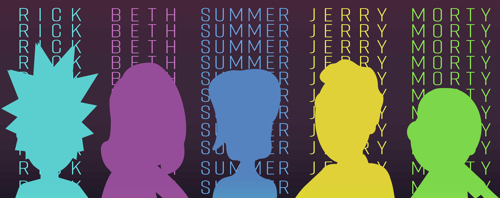
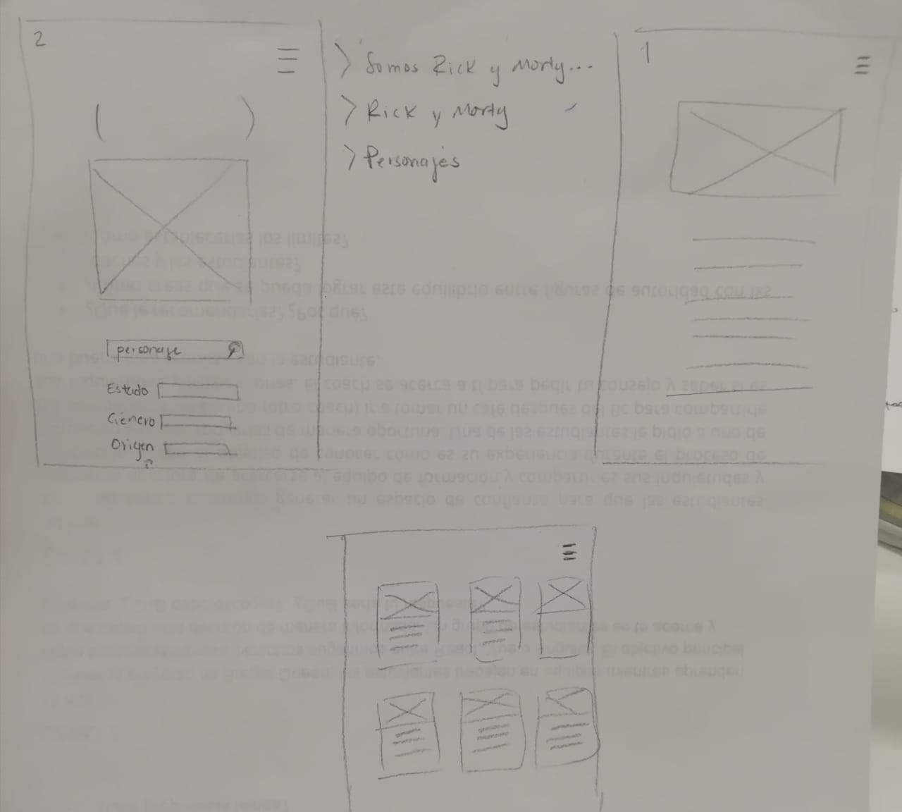

# PORTAL RICK AND MORTY

## Índice

* [1. Twit](#1-twit)
* [2. Resumen de la aplicación](#2-resumen-de-la-aplicación)
* [3. Objetivos de aprendizaje](#3-objetivos-de-aprendizaje)
* [4. Consideraciones generales de la app](#4-consideraciones-generales-de-la-app)
* [5. Creación de historias de usuario](#5-creación-de-historias-de-usuario)
* [6. Primer prototipo en papel)](#6-primer-prototipo-en-papel)
* [7. Testeo](#7-testeo)
* [8. Prototipo en alta](#8-pprototipo-en-alta)

***

## 1. Twit

"App creada para que recuerdes el nombre de algun personaje que hayas visto y,
no te pierdas ni un detalle de tus personajes favoritos de Rick and Morty"

## 2. Resumen de la aplicación

Portal Rick and Morty nace inmediatamente después de ver el segundo capítulo de
esta serie y darme cuenta de la cantidad tan inmensa que existen de personajes.

Es fácil perderse y cuando hacen referencia alguno, sería mucho mejor contar con
una herramienta cómo esta app para buscar el nombre de mi personaje o, mediante
ciertas pistas (filtros) irme acercando a su identidad.

### Historias de usuario:

* [1. Jóvenes y adultos]

    "Quiero entrar a la app y poder visualizar todos los personajes de la serie,
    así cómo sus características"

* [2. Jóvenes y adultos]

  "Una vez visualizados todos los personajes, quisiera poder acomodarlos de
  acuerdo a su nombre por orden alfabético"

* [3. Jóvenes y adultos]

  "Una vez visualizados todos los personajes, quisiera poder filtrarlos por
  género y por especie"

* [4. Jóvenes y adultos]

  "Me gustaría poder ingresar a la app y poder buscar de manera inmediata el
  nombre de mi personaje favorito para conocer sus características"

## 3. Objetivos de aprendizaje

### UX

- [✓] Diseñar la aplicación pensando y entendiendo al usuario.
- [✓] Crear prototipos para obtener _feedback_ e iterar.
- [✓] Aplicar los principios de diseño visual (contraste, alineación, jerarquía).
- [✓] Planear y ejecutar _tests_ de usabilidad.

### HTML y CSS

- [✓] Entender y reconocer por qué es importante el HTML semántico.
- [✓] Identificar y entender tipos de selectores en CSS.
- [✓❅] Entender como funciona `flexbox` en CSS.
- [✓] Construir tu aplicación respetando el diseño planeado (maquetación).

### DOM

- [✓] Entender y reconocer los selectores del DOM (querySelector | querySelectorAll).
- [✓] Manejar eventos del DOM. (addEventListener)
- [✓] Manipular dinámicamente el DOM. (createElement, appendchild, innerHTML, value)

### Javascript

- [✓❅] Manipular arrays (`filter` | `map` | `sort` | `reduce`).
- [✓] Manipular objects (key | value).
- [✓] Entender el uso de condicionales (`if-else` | `switch`).
- [✓] Entender el uso de bucles (`for` | `forEach`).
- [✓] Entender la diferencia entre expression y statements.
- [✓] Utilizar funciones (parámetros | argumentos | valor de retorno).
- [✓] Entender la diferencia entre tipos de datos atómicos y estructurados.
- [✓] Utilizar ES Modules (`import` | `export`).

### Pruebas Unitarias (_testing_)
- [✗] Testear funciones (funciones puras).

### Git y GitHub
- [✓] Ejecutar comandos de git (`add` | `commit` | `pull` | `status` | `push`).
- [✓❅] Utilizar los repositorios de GitHub (`clone` | `fork` | gh-pages).
- [✓] Colaborar en Github (pull requests).

### Buenas prácticas de desarrollo
- [✓] Organizar y dividir el código en módulos (Modularización).
- [✓] Utilizar identificadores descriptivos (Nomenclatura | Semántica).
- [✗] Utilizar linter para seguir buenas prácticas (ESLINT).

## 4. Consideraciones generales de la app

La app consta de un menú navegable por tres vistas/páginas:

* Portal: Aquí se encuentra el buscador principal por personaje.
* ¿Rick and Morty?: Breve reseña de la serie.
* Characteres: Vista de todos los personajes de la serie así cómo los filtros.

## 5. Creación de historias de usuario

Para las historias de usuario se tomó la decisión de no contemplar sólo la opinión
del público en general de cualquier serie, sino desde dos tipos de público:
aquellos que son nuevos al ver la serie y les cuesta trabajo identificar los
nombres de los personajes y, por otro lado aquellos que ya son fans de la serie
y desean conocer las características de sus personajes favoritos.

Priorizando siempre a los usuarios novatos de la serie fue que la app cobró más
sentido.

En cuanto a lo técnico, cabe mencionar que en todo momento se procuró seguir en
orden las historias de usuario. Esto permite a uno como aprendiz, poder pasar
por las los objetivos de aprendizaje de manera repetitiva, siendo así afianzados.

### Cuestionario para usuario

1- ¿Conoces la serie Rick and Morty?

2- ¿Cuántos capítulos has visto de la serie?

3- ¿Te consideras fan de la serie?

4- ¿Conoces el nombre de estos personajes? (mostrando personajes al azar)

5- ¿Conoces las características de tu personaje favorito?

6- Si existiera una app de Rick and Morty enfocada en los personajes, ¿qué te
gustaría poder hacer en ella?

## 6. Primer prototipo en papel

## 7. Testeo

Posterior al prototipo en baja se realizaron otros dos más para poder iterarlos
con los usuarios correspondientes al cuestionario inicial.

* Los usuarios comentaron que había muchos elementos de busqueda y filtros en la
primer página.

* Algunos usuarios comentaban que se sentían confundidos con los filtros.

* Los usuarios comentaban que en la página de personajes les gustaría más ver
sólo imágenes y que existiera otra función que les dejara ver la información de
los personajes.

## 8. Prototipo en alta

https://www.youtube.com/watch?v=f0o3pMHDDzU
